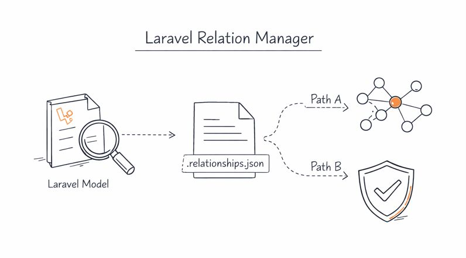
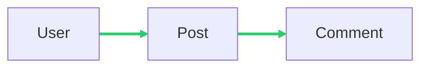

[]()
[]()
[](https://packagist.org/packages/schenke-io/laravel-relation-manager)
[](https://packagist.org/packages/schenke-io/laravel-relation-manager)
[](https://github.com/schenke-io/laravel-relation-manager/actions/workflows/run-tests.yml)
[](https://github.com/schenke-io/laravel-relation-manager/blob/main/LICENSE.md)

<!--
********************************************************************************
*                                                                              *
*     DO NOT EDIT THIS FILE MANUALLY! IT WILL BE OVERWRITTEN.                  *
*                                                                              *
*     This file was generated by: workbench/app/Console/Commands/WriteMarkdownCommand.php
*     Source files are located in: workbench/resources/md
*
*     If you want to change the content, edit the source files instead.        *
*                                                                              *
********************************************************************************
-->
# Schenke Io Laravel Relation Manager

> Allow to plan, document and test model relations in Laravel



Developing complex Laravel applications with many models can be difficult.
**Laravel Relation Manager** helps by bringing all your model relationships
together. It creates tests to make sure they work and documents them for
easy reference. This saves you time, improves code quality,
and keeps your project organized.

* [Schenke Io Laravel Relation Manager](#schenke-io-laravel-relation-manager)
  * [Installation](#installation)
  * [Workflow](#workflow)
    * [The Draw Command](#the-draw-command)
      * [Understanding the Diagram](#understanding-the-diagram)
    * [Configuration](#configuration)
* [Examples and Guides](#examples-and-guides)
  * [1. Automatic Discovery](#1.-automatic-discovery)
  * [2. Declarative Relations via Attributes](#2.-declarative-relations-via-attributes)
    * [On the Method Level](#on-the-method-level)
    * [Automatic Reverse Relations](#automatic-reverse-relations)
    * [Suppressing Relationships](#suppressing-relationships)
  * [3. Testing Your Relations](#3.-testing-your-relations)
    * [Using PHPUnit](#using-phpunit)
    * [Using Pest](#using-pest)
  * [4. Visualizing Relations](#4.-visualizing-relations)
    * [Mermaid Diagram Example](#mermaid-diagram-example)
    * [Relationship Table Example](#relationship-table-example)
  * [Testing Relationships](#testing-relationships)
    * [Strict vs. Loose Mode](#strict-vs.-loose-mode)
    * [PHPUnit Integration](#phpunit-integration)
    * [Pest PHP Integration](#pest-php-integration)

## Installation

You can install the package via composer:

```bash
composer require schenke-io/laravel-relation-manager
```

After installation, you can start by scanning your models and generating the initial `.relationships.json` file:

```bash
php artisan relation:extract
```

## Workflow

Laravel Relation Manager helps you maintain consistency in your Eloquent relationships through a simple three-step process:

1. **Extract**: `php artisan relation:extract` - Scans your models and saves the relationship state to `.relationships.json`.
2. **Verify**: `php artisan relation:verify` - Ensures your code implementation matches the defined relationship state.
3. **Draw**: `php artisan relation:draw [filename]` - Generates visualization (diagrams and tables) of your model relationships.

### The Draw Command

The `relation:draw` command generates a comprehensive Markdown file (default: `RELATIONS.md`) that includes:
- **Model relations table**: Listing direct and indirect relations for each model.
- **Table relations diagram**: A visual representation of your database schema.
- **Database overview**: Expected tables and their foreign key columns.
- **Relationship details**: A complete list of all defined relationships.

You can optionally provide a filename to override the default path.

#### Understanding the Diagram

In the Mermaid diagram, arrows represent relationships between tables.
- **Colors**:
    - **Green** (`#2ecc71`): Standard Eloquent relations (One-to-One, One-to-Many).
    - **Blue** (`#3498db`): Polymorphic relations.
    - **Orange** (`#e67e22`): Many-to-Many relations.
- **Line Styles**:
    - `==>` : Standard direct relations.
    - `-->` : Polymorphic relations.
    - `<==>` : Many-to-Many relations.

**FAQ: Why is there an arrow from `tags` to `regions`?**
This occurs when a model (like `Tag`) has a relationship method pointing to another model (like `Region`). Even if the database foreign key is on a pivot table or the other model, the diagram reflects the intent of the relationship method defined in the model.

**Suggestion**: If you want to exclude certain methods from the diagram, use the `#[Relation(EloquentRelation::noRelation)]` attribute.

### Configuration

The `.relationships.json` file contains a `config` section to customize the behavior:

- `markdown_path`: Path where the relations documentation will be generated (default: `RELATIONS.md`).
- `model_path`: Directory where your Eloquent models are located (default: `app/Models`).
- `use_mermaid`: Boolean to toggle between Mermaid (default) and Graphviz diagram generation.

# Examples and Guides

This guide provides practical examples of how to use the Laravel Relation Manager with its new features.

## 1. Automatic Discovery

The easiest way to get started is by letting the package discover your relations automatically. 
Ensure your model methods have proper return type hints.

```php
namespace App\Models;

use Illuminate\Database\Eloquent\Model;
use Illuminate\Database\Eloquent\Relations\HasMany;

class User extends Model
{
    public function posts(): HasMany
    {
        return $this->hasMany(Post::class);
    }
}
```

When you run `php artisan relation:extract`, this relation will be automatically detected and saved to `.relationships.json`.

## 2. Declarative Relations via Attributes

Sometimes you might want to provide additional metadata to your relationships or explicitly mark methods to be ignored.

### On the Method Level

```php
use SchenkeIo\LaravelRelationManager\Attributes\Relation;
use SchenkeIo\LaravelRelationManager\Enums\EloquentRelation as RelationEnum;

class User extends Model
{
    #[Relation(RelationEnum::hasMany, Post::class)]
    public function posts()
    {
        return $this->hasMany(Post::class);
    }
}
```

### Automatic Reverse Relations

You can tell the scanner to automatically inject the inverse relation into the related model:

```php
#[Relation(RelationEnum::hasMany, Comment::class, addReverse: true)]
public function comments()
{
    return $this->hasMany(Comment::class);
}
```

### Suppressing Relationships

If you have a method that should not be treated as a relationship, you can explicitly mark it with `noRelation`:

```php
use SchenkeIo\LaravelRelationManager\Attributes\Relation;
use SchenkeIo\LaravelRelationManager\Enums\EloquentRelation as RelationEnum;

class User extends Model
{
    #[Relation(RelationEnum::noRelation)]
    public function internalMethod()
    {
        // this will be ignored by the scanner
    }
}
```

## 3. Testing Your Relations

### Using PHPUnit

Add the `RelationTestTrait` trait to your test class:

```php
use SchenkeIo\LaravelRelationManager\Phpunit\RelationTestTrait;

class ModelRelationTest extends TestCase
{
    use RelationTestTrait;

    public function test_user_has_many_posts()
    {
        $this->assertModelHasMany(User::class, Post::class);
    }
}
```

### Using Pest

If you are using Pest, you can use the fluent expectations:

```php
it('has the correct relations', function () {
    expect(User::class)->toHasMany(Post::class);
    expect(Post::class)->toBelongsTo(User::class);
});
```

## 4. Visualizing Relations

Generate a diagram or a Markdown table of your relations:

```bash
php artisan relation:draw
```

By default, this command uses the data from `.relationships.json`. It supports:
- **Mermaid.js**: Default tool for embedding diagrams in Markdown (GitHub/GitLab compatible).
- **Graphviz**: An alternative that generates a PNG file (requires `dot` to be installed). This is automatically used if `use_mermaid` is set to `false` in the configuration.

### Mermaid Diagram Example



### Relationship Table Example

<table>
<tr><th>Model</th><th>Method(): Relation</th><th>Related Model</th><th>Reverse Relation</th></tr>
<tr><td rowspan="2">User</td><td><code>posts(): hasMany</code></td><td>Post</td><td>Post::author</td></tr>
<tr><td><code>profile(): hasOne</code></td><td>Profile</td><td>Profile::user</td></tr>
</table>

Here an example of a [generated markdown](workbench/resources/md/relations.md) file.

## Testing Relationships

The package provides built-in tools to verify that your model implementation matches your `.relationships.json` file. This ensures that your documentation, diagrams, and actual code are always in sync.

### Strict vs. Loose Mode

- **Loose Mode (Default)**: Validates that every relationship defined in your `.relationships.json` file exists in your code. It ignores extra relationships in your code that are not defined in the JSON.
- **Strict Mode**: In addition to Loose Mode checks, it also fails if it finds relationships in your models that are *not* defined in your `.relationships.json` file. This is recommended for maintaining a complete and accurate documentation of your data model.

---

### PHPUnit Integration

To use with PHPUnit, create a test class that extends `AbstractRelationTest`.

```php
<?php

namespace Tests\Feature;

use SchenkeIo\LaravelRelationManager\Phpunit\AbstractRelationTest;

class RelationshipTest extends AbstractRelationTest
{
    /**
     * Optional: Path to your relationships file. 
     * Defaults to the one found by PathResolver (.relationships.json).
     */
    protected ?string $relationshipJsonPath = null;

    /**
     * Optional: Directory containing your models.
     * Defaults to the one defined in .relationships.json config 
     * or 'app/Models'.
     */
    protected ?string $modelDirectory = null;

    /**
     * Set to true for Strict Mode.
     */
    protected bool $strict = true;
}
```

The base class provides the following tests:
1. `test_laravel_environment`: Ensures the test runs within a Laravel environment.
2. `test_relationship_json_exists_and_is_valid`: Verifies that the JSON file is present and correctly formatted.
3. `test_models_match_json_state`: Compares the model implementation against the JSON definition.

---

### Pest PHP Integration

For Pest, you can use the `RelationTestBridge` to quickly register all necessary tests in a single call.

```php
<?php

use SchenkeIo\LaravelRelationManager\Pest\RelationTestBridge;

RelationTestBridge::all(
    relationshipJsonPath: null, // optional, defaults to PathResolver
    modelDirectory: null,       // optional, defaults to config or 'app/Models'
    strict: true                // recommended, defaults to false
);
```

This will automatically register three tests in your Pest file:
1. `test('laravel environment', ...)`
2. `test('relationship json exists and is valid', ...)`
3. `test('models match json state', ...)`


---

Markdown file generated by [schenke-io/packaging-tools](https://github.com/schenke-io/packaging-tools)
