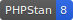

<!--

This file was written by 'WriteMarkdownCommand.php' line 22 using
SchenkeIo\PackagingTools\Markdown\MarkdownAssembler

Do not edit manually as it will be overwritten.

-->
# Laravel Relation Manager


[](https://packagist.org/packages/schenke-io/laravel-relation-manager)
[](https://github.com/schenke-io/laravel-relation-manager/actions/workflows/%3Arun-tests.yml%3Amain)
[](https://packagist.org/packages/schenke-io/laravel-relation-manager)
[]()
[]()


Developing complex Laravel applications with many models can be difficult.
**Laravel Relation Manager** helps by bringing all your model relationships
together. It creates tests to make sure they work and documents them for
easy reference. This saves you time, improves code quality,
and keeps your project organized.


* [Laravel Relation Manager](#laravel-relation-manager)
  * [Installation](#installation)
  * [Workflow](#workflow)
* [Examples and Guides](#examples-and-guides)
  * [1. Automatic Discovery](#1.-automatic-discovery)
  * [2. Declarative Relations via Attributes](#2.-declarative-relations-via-attributes)
    * [On the Class Level](#on-the-class-level)
    * [On the Method Level](#on-the-method-level)
    * [Suppressing Relationships](#suppressing-relationships)
  * [3. Testing Your Relations](#3.-testing-your-relations)
    * [Using PHPUnit](#using-phpunit)
    * [Using Pest](#using-pest)
  * [4. Visualizing Relations](#4.-visualizing-relations)
  * [Testing Relationships](#testing-relationships)
    * [Strict vs. Loose Mode](#strict-vs.-loose-mode)
    * [PHPUnit Integration](#phpunit-integration)
    * [Pest PHP Integration](#pest-php-integration)


## Installation

You can install the package via composer:

```bash
composer require schenke-io/laravel-relation-manager
```

After installation, you can start by scanning your models and generating the initial `.relationships.json` file:

```bash
php artisan relation:extract
```


## Workflow

Laravel Relation Manager helps you maintain consistency in your Eloquent relationships through a simple three-step process:

1. **Extract**: `php artisan relation:extract` - Scans your models and saves the relationship state to `.relationships.json`.
2. **Verify**: `php artisan relation:verify` - Ensures your code implementation matches the defined relationship state.
3. **Draw**: `php artisan relation:draw` - Generates visualization (diagrams and tables) of your model relationships.


[View Model Relationships](docs/relationships.md)


# Examples and Guides

This guide provides practical examples of how to use the Laravel Relation Manager with its new features.

## 1. Automatic Discovery

The easiest way to get started is by letting the package discover your relations automatically. 
Ensure your model methods have proper return type hints.

```php
namespace App\Models;

use Illuminate\Database\Eloquent\Model;
use Illuminate\Database\Eloquent\Relations\HasMany;

class User extends Model
{
    public function posts(): HasMany
    {
        return $this->hasMany(Post::class);
    }
}
```

When you run `php artisan relation:extract`, this relation will be automatically detected and saved to `.relationships.json`.

## 2. Declarative Relations via Attributes

Sometimes you might want to define relations that are not explicitly in your code yet, or you want to provide additional metadata.

### On the Class Level

```php
use SchenkeIo\LaravelRelationManager\Attributes\Relation;
use SchenkeIo\LaravelRelationManager\Enums\Relation as RelationEnum;

#[Relation(RelationEnum::hasMany, Comment::class, addReverse: true)]
class Post extends Model
{
    // ...
}
```

### On the Method Level

```php
use SchenkeIo\LaravelRelationManager\Attributes\Relation;
use SchenkeIo\LaravelRelationManager\Enums\Relation as RelationEnum;

class User extends Model
{
    #[Relation(RelationEnum::hasMany, Post::class)]
    public function posts()
    {
        return $this->hasMany(Post::class);
    }
}
```

### Suppressing Relationships

If you have a method that should not be treated as a relationship, you can explicitly mark it with `noRelation`:

```php
use SchenkeIo\LaravelRelationManager\Attributes\Relation;
use SchenkeIo\LaravelRelationManager\Enums\Relation as RelationEnum;

class User extends Model
{
    #[Relation(RelationEnum::noRelation)]
    public function internalMethod()
    {
        // this will be ignored by the scanner
    }
}
```

## 3. Testing Your Relations

### Using PHPUnit

Add the `RelationTestTrait` trait to your test class:

```php
use SchenkeIo\LaravelRelationManager\Phpunit\RelationTestTrait;

class ModelRelationTest extends TestCase
{
    use RelationTestTrait;

    public function test_user_has_many_posts()
    {
        $this->assertModelHasMany(User::class, Post::class);
    }
}
```

### Using Pest

If you are using Pest, you can use the fluent expectations:

```php
it('has the correct relations', function () {
    expect(User::class)->toHasMany(Post::class);
    expect(Post::class)->toBelongsTo(User::class);
});
```

## 4. Visualizing Relations

Generate a Mermaid diagram or a Markdown table of your relations:

```bash
php artisan relation:draw
```

By default, this command uses the data from `.relationships.json` and can be configured to output different formats or to a specific file.


## Testing Relationships

The package provides built-in tools to verify that your model implementation matches your `.relationships.json` file. This ensures that your documentation, diagrams, and actual code are always in sync.

### Strict vs. Loose Mode

- **Loose Mode (Default)**: Validates that every relationship defined in your `.relationships.json` file exists in your code. It ignores extra relationships in your code that are not defined in the JSON.
- **Strict Mode**: In addition to Loose Mode checks, it also fails if it finds relationships in your models that are *not* defined in your `.relationships.json` file. This is recommended for maintaining a complete and accurate documentation of your data model.

---

### PHPUnit Integration

To use with PHPUnit, create a test class that extends `AbstractRelationTest`.

```php
<?php

namespace Tests\Feature;

use SchenkeIo\LaravelRelationManager\Phpunit\AbstractRelationTest;

class RelationshipTest extends AbstractRelationTest
{
    /**
     * Optional: Path to your relationships file. 
     * Defaults to the one found by PathResolver (.relationships.json).
     */
    protected ?string $relationshipJsonPath = null;

    /**
     * Optional: Directory containing your models.
     * Defaults to the one defined in .relationships.json config 
     * or 'app/Models'.
     */
    protected ?string $modelDirectory = null;

    /**
     * Set to true for Strict Mode.
     */
    protected bool $strict = true;
}
```

The base class provides the following tests:
1. `test_laravel_environment`: Ensures the test runs within a Laravel environment.
2. `test_relationship_json_exists_and_is_valid`: Verifies that the JSON file is present and correctly formatted.
3. `test_models_match_json_state`: Compares the model implementation against the JSON definition.

---

### Pest PHP Integration

For Pest, you can use the `RelationTestBridge` to quickly register all necessary tests in a single call.

```php
<?php

use SchenkeIo\LaravelRelationManager\Pest\RelationTestBridge;

RelationTestBridge::all(
    relationshipJsonPath: null, // optional, defaults to PathResolver
    modelDirectory: null,       // optional, defaults to config or 'app/Models'
    strict: true                // recommended, defaults to false
);
```

This will automatically register three tests in your Pest file:
1. `test('laravel environment', ...)`
2. `test('relationship json exists and is valid', ...)`
3. `test('models match json state', ...)`


---


README generated at 2026-01-15 07:53:00 using [packaging-tools](https://github.com/schenke-io/packaging-tools)


