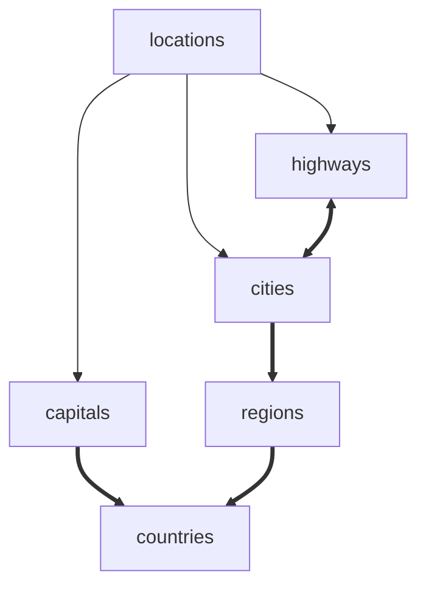

<!--
written with: php artisan run:test-project
by Console Command Workbench\App\Console\Commands\RunTestProjectManagerCommand
do not manually edit this file as it will be overwritten

-->

## Model relations

<table>
<tr><th>model</th><th>direct</th><th>indirect</th></tr><tr><td>City</td><td>Location, Region</td><td>Country, Highway</td></tr>
<tr><td>Highway</td><td>Location</td><td>City</td></tr>
<tr><td>Location</td><td>Capital, City, Highway</td><td></td></tr>
<tr><td>Country</td><td>Capital, Region</td><td>City</td></tr>
<tr><td>Capital</td><td>Country, Location</td><td></td></tr>
<tr><td>Region</td><td>City, Country</td><td>Capital</td></tr>
<tr><td>Single</td><td></td><td></td></tr>
<tr><td>Green (not defined)</td><td></td><td></td></tr>

</table>

## Table relations

## Database

<table>
<tr><th>table</th><th>required fields</th></tr><tr><td>capitals</td><td>country_id</td></tr>
<tr><td>cities</td><td>region_id</td></tr>
<tr><td>city_highway</td><td>city_id, highway_id</td></tr>
<tr><td>countries</td><td></td></tr>
<tr><td>highways</td><td></td></tr>
<tr><td>locations</td><td>locationable_id, locationable_type</td></tr>
<tr><td>regions</td><td>country_id</td></tr>
<tr><td>singles</td><td></td></tr>

</table>

