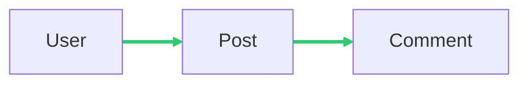

# Examples and Guides

This guide provides practical examples of how to use the Laravel Relation Manager with its new features.

## 1. Automatic Discovery

The easiest way to get started is by letting the package discover your relations automatically. 
Ensure your model methods have proper return type hints.

```php
namespace App\Models;

use Illuminate\Database\Eloquent\Model;
use Illuminate\Database\Eloquent\Relations\HasMany;

class User extends Model
{
    public function posts(): HasMany
    {
        return $this->hasMany(Post::class);
    }
}
```

When you run `php artisan relation:extract`, this relation will be automatically detected and saved to `.relationships.json`.

## 2. Declarative Relations via Attributes

Sometimes you might want to provide additional metadata to your relationships or explicitly mark methods to be ignored.

### On the Method Level

```php
use SchenkeIo\LaravelRelationManager\Attributes\Relation;
use SchenkeIo\LaravelRelationManager\Enums\EloquentRelation as RelationEnum;

class User extends Model
{
    #[Relation(RelationEnum::hasMany, Post::class)]
    public function posts()
    {
        return $this->hasMany(Post::class);
    }
}
```

### Automatic Reverse Relations

You can tell the scanner to automatically inject the inverse relation into the related model:

```php
#[Relation(RelationEnum::hasMany, Comment::class, addReverse: true)]
public function comments()
{
    return $this->hasMany(Comment::class);
}
```

### Suppressing Relationships

If you have a method that should not be treated as a relationship, you can explicitly mark it with `noRelation`:

```php
use SchenkeIo\LaravelRelationManager\Attributes\Relation;
use SchenkeIo\LaravelRelationManager\Enums\EloquentRelation as RelationEnum;

class User extends Model
{
    #[Relation(RelationEnum::noRelation)]
    public function internalMethod()
    {
        // this will be ignored by the scanner
    }
}
```

## 3. Testing Your Relations

### Using PHPUnit

Add the `RelationTestTrait` trait to your test class:

```php
use SchenkeIo\LaravelRelationManager\Phpunit\RelationTestTrait;

class ModelRelationTest extends TestCase
{
    use RelationTestTrait;

    public function test_user_has_many_posts()
    {
        $this->assertModelHasMany(User::class, Post::class);
    }
}
```

### Using Pest

If you are using Pest, you can use the fluent expectations:

```php
it('has the correct relations', function () {
    expect(User::class)->toHasMany(Post::class);
    expect(Post::class)->toBelongsTo(User::class);
});
```

## 4. Visualizing Relations

Generate a diagram or a Markdown table of your relations:

```bash
php artisan relation:draw
```

By default, this command uses the data from `.relationships.json`. It supports:
- **Mermaid.js**: Default tool for embedding diagrams in Markdown (GitHub/GitLab compatible).
- **Graphviz**: An alternative that generates a PNG file (requires `dot` to be installed). This is automatically used if `use_mermaid` is set to `false` in the configuration.

### Mermaid Diagram Example



### Relationship Table Example

<table>
<tr><th>Model</th><th>Method(): Relation</th><th>Related Model</th><th>Reverse Relation</th></tr>
<tr><td rowspan="2">User</td><td><code>posts(): hasMany</code></td><td>Post</td><td>Post::author</td></tr>
<tr><td><code>profile(): hasOne</code></td><td>Profile</td><td>Profile::user</td></tr>
</table>

Here an example of a [generated markdown](workbench/resources/md/relations.md) file.
