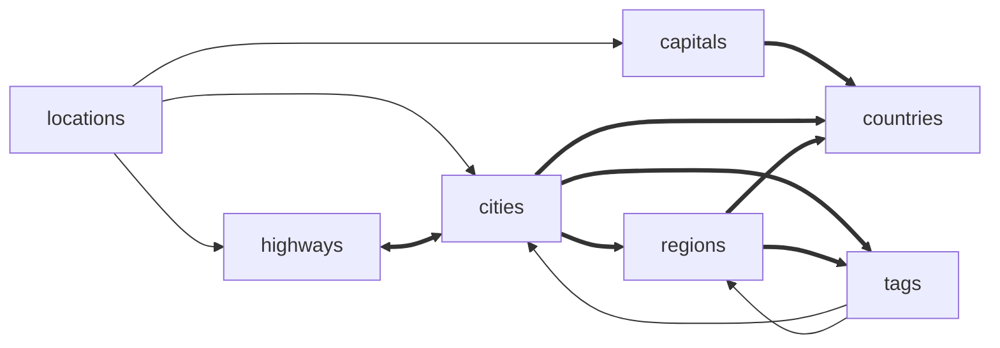

# Relationships

## 1. Model relations

| Model | Direct | Indirect |
| --- | --- | --- |
| Capital | country (Country) | location (Location) |
| City | region (Region) tags (Tag) | country (Country) highways (Highway) location (Location) |
| Country | capital (Capital) oldest (City) regions (Region) | cities (City) |
| Highway |  | cities (City) locations (Location) |
| Location |  | locationable (n/a) |
| Region | cities (City) country (Country) tags (Tag) | capital (Capital) |
| Single |  |  |
| Tag |  | cities (City) regions (Region) |

## 2. Table relations (Diagram)

## 3. Database

| Table | Required Fields |
| --- | --- |
| capitals | country_id |
| cities | region_id |
| city_highway | city_id highway_id |
| countries |  |
| highways |  |
| locations | locationable_id locationable_type |
| regions | country_id |
| singles |  |
| tags |  |

## 4. Relationship Details

| Model | Method | Relation | Related Model |
| --- | --- | --- | --- |
| Capital | country | belongsTo | Country |
| Capital | location | morphOne | Location |
| City | tags | morphToMany | Tag |
| City | region | belongsTo | Region |
| City | highways | belongsToMany | Highway |
| City | country | hasOneThrough | Country |
| City | location | morphOne | Location |
| Country | capital | hasOne | Capital |
| Country | oldest | hasOne | City |
| Country | regions | hasMany | Region |
| Country | cities | hasManyThrough | City |
| Highway | cities | belongsToMany | City |
| Highway | locations | morphMany | Location |
| Location | locationable | morphTo | a |
| Region | tags | morphToMany | Tag |
| Region | country | belongsTo | Country |
| Region | cities | hasMany | City |
| Region | capital | hasOneThrough | Capital |
| Tag | cities | morphedByMany | City |
| Tag | regions | morphedByMany | Region |
