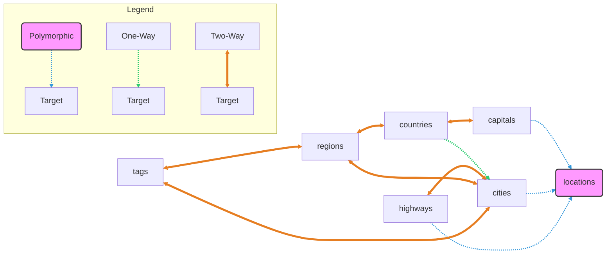

# Relationships

## 1. Model relations

| Model | Direct | Indirect |
| --- | --- | --- |
| Capital | country (Country) | location (Location) |
| City | region (Region) tags (Tag) | country (Country) highways (Highway) location (Location) |
| Country | capital (Capital) oldest (City) regions (Region) | cities (City) |
| Highway |  | cities (City) locations (Location) |
| Location |  | locationable (Location) |
| Region | cities (City) country (Country) tags (Tag) | capital (Capital) |
| Single |  |  |
| Tag | cities (City) regions (Region) |  |

## 2. Table relations (Diagram)

## 3. Database

| Table | Required Fields |
| --- | --- |
| capitals | country_id |
| cities | region_id |
| city_highway | city_id, highway_id |
| countries |  |
| highways |  |
| locations | locationable_id, locationable_type |
| regions | country_id |
| singles |  |
| tags |  |

## 4. Relationship Details

<table>
<tr><th>Model</th><th>Method(): Relation</th><th>Related Model</th><th>Reverse Relation</th></tr><tr><td rowspan="2">Capital</td><td><code>country(): belongsTo</code></td><td>Country</td><td>n/a</td></tr>
<tr><td><code>location(): morphOne</code></td><td>Location</td><td>n/a</td></tr>
<tr><td rowspan="5">City</td><td><code>tags(): morphToMany</code></td><td>Tag</td><td>n/a</td></tr>
<tr><td><code>region(): belongsTo</code></td><td>Region</td><td>Region::cities</td></tr>
<tr><td><code>highways(): belongsToMany</code></td><td>Highway</td><td>Highway::cities</td></tr>
<tr><td><code>country(): hasOneThrough</code></td><td>Country</td><td>n/a</td></tr>
<tr><td><code>location(): morphOne</code></td><td>Location</td><td>n/a</td></tr>
<tr><td rowspan="4">Country</td><td><code>capital(): hasOne</code></td><td>Capital</td><td>Capital::country</td></tr>
<tr><td><code>oldest(): hasOne</code></td><td>City</td><td>n/a</td></tr>
<tr><td><code>regions(): hasMany</code></td><td>Region</td><td>Region::country</td></tr>
<tr><td><code>cities(): hasManyThrough</code></td><td>City</td><td>n/a</td></tr>
<tr><td rowspan="2">Highway</td><td><code>cities(): belongsToMany</code></td><td>City</td><td>City::highways</td></tr>
<tr><td><code>locations(): morphMany</code></td><td>Location</td><td>n/a</td></tr>
<tr><td>Location</td><td><code>locationable(): morphTo</code></td><td>Capital, City, Highway</td><td>n/a</td></tr>
<tr><td rowspan="4">Region</td><td><code>tags(): morphToMany</code></td><td>Tag</td><td>n/a</td></tr>
<tr><td><code>country(): belongsTo</code></td><td>Country</td><td>Country::regions</td></tr>
<tr><td><code>cities(): hasMany</code></td><td>City</td><td>City::region</td></tr>
<tr><td><code>capital(): hasOneThrough</code></td><td>Capital</td><td>n/a</td></tr>
<tr><td rowspan="2">Tag</td><td><code>cities(): morphToMany</code></td><td>City</td><td>n/a</td></tr>
<tr><td><code>regions(): morphToMany</code></td><td>Region</td><td>n/a</td></tr>

</table>
